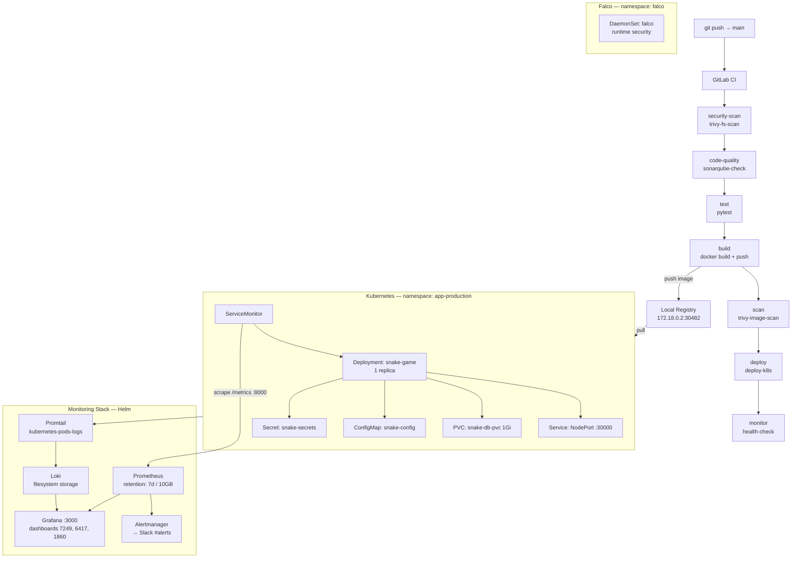
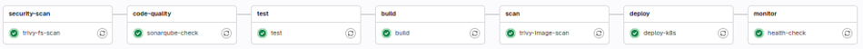
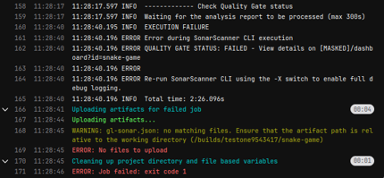
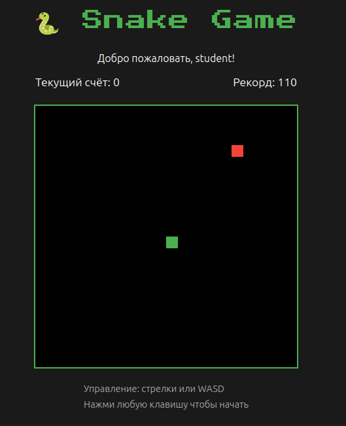
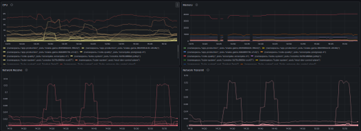
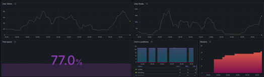
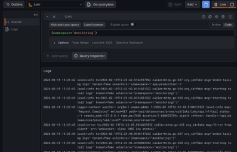
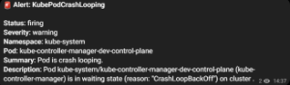

# Snake Game — DevOps Portfolio Project

Flask-приложение «Змейка» с полным DevOps-стеком: CI/CD, контейнеризация, оркестрация в Kubernetes, мониторинг и runtime security.


---

## Архитектурная схема



---

## Стек

| Инструмент | Вариант / версия | Назначение |
|---|---|---|
| Python | 3.9-slim | Runtime приложения |
| Flask | 3.x | Web-фреймворк |
| Flask-WTF | 1.2.1 | CSRF-защита форм |
| Flask-Limiter | 3.5.1 | Rate limiting запросов |
| prometheus-client | 0.19.0 | Экспорт метрик на :8000/metrics |
| SQLite | встроенный | База данных (лидерборд, пользователи) |
| Docker | latest | Контейнеризация |
| kind | local | Локальный Kubernetes-кластер |
| Local Registry | 172.18.0.2:30482 | Хранилище образов для kind |
| GitLab CI | — | 8-стадийный pipeline |
| Trivy | aquasec/trivy:latest | Сканирование FS и Docker-образов |
| SonarQube | sonarsource/sonar-scanner-cli:latest | Статический анализ кода |
| Prometheus | kube-prometheus-stack (Helm) | Сбор метрик, retention 7d |
| Alertmanager | kube-prometheus-stack (Helm) | Роутинг алертов в Slack |
| Grafana | Helm, PVC 10Gi | Дашборды |
| Loki | Helm, SimpleScalable | Агрегация логов, хранение на FS |
| Promtail | Helm | Сбор логов с kubernetes-pods |
| Falco | falcosecurity/falco:latest | Runtime security (DaemonSet) |
| node-exporter | kube-prometheus-stack | Метрики узлов |
| kube-state-metrics | kube-prometheus-stack | Метрики объектов K8s |

---

## CI/CD Pipeline

8 стадий, запускаются последовательно на `main`.

### 1. `security-scan` — `trivy-fs-scan`

```bash
trivy fs --exit-code 1 --severity HIGH,CRITICAL .
```

Сканирует файловую систему репозитория образом `aquasec/trivy:latest`. При обнаружении HIGH/CRITICAL уязвимостей — pipeline падает (`allow_failure: false`). Результаты кешируются в `.trivycache/`.

### 2. `code-quality` — `sonarqube-check`

```bash
sonar-scanner \
  -Dsonar.sources=snake/ \
  -Dsonar.tests=snake/tests \
  -Dsonar.test.inclusions="**/test_*.py" \
  -Dsonar.qualitygate.wait=true \
  -Dsonar.host.url="${SONAR_HOST_URL}" \
  -Dsonar.login="${SONAR_TOKEN}"
```

Запускается на `main` и при MR. Блокирует pipeline при непрохождении Quality Gate (`sonar.qualitygate.wait=true`). Артефакт: `gl-sonar.json` (CodeQuality report).

### 3. `test` — `test`

```bash
cd snake && pip install -r requirements.txt
python -m pytest tests/ -q
```

Образ `python:3.9-slim`. Артефакт: `snake/coverage_report/` (TTL 1 week).

### 4. `build` — `build`

```bash
docker build -t 172.18.0.2:30482/snake-game:${CI_COMMIT_SHA} .
docker push 172.18.0.2:30482/snake-game:${CI_COMMIT_SHA}
docker push 172.18.0.2:30482/snake-game:latest
```

Docker-in-Docker (`docker:dind`). Образ тегируется commit SHA и `latest`, пушится в локальный registry кластера. Запускается только на `main`.

### 5. `scan` — `trivy-image-scan`

```bash
trivy image --exit-code 0 --format table 172.18.0.2:30482/snake-game:latest
trivy image --exit-code 1 --severity CRITICAL 172.18.0.2:30482/snake-game:latest
```

Сначала выводит полную таблицу уязвимостей (exit-code 0), затем проверяет только CRITICAL — при наличии pipeline падает.

### 6. `deploy` — `deploy-k8s`

```bash
kubectl set image deployment/snake-game snake-game=172.18.0.2:30482/snake-game:${CI_COMMIT_SHA} \
  -n app-production
kubectl rollout status deployment/snake-game -n app-production --timeout=5m
```

Образ `bitnami/kubectl:latest`. `KUBE_CONFIG` передаётся через переменную CI (base64). Rolling update с ожиданием завершения rollout.

### 7–8. `monitor` — `health-check`

```bash
kubectl get pods -n app-production
kubectl get svc -n app-production
```

Проверка состояния после деплоя. `allow_failure: true` — не блокирует pipeline при недоступности кластера.

---

## Security

### Trivy — сканирование файловой системы

- Запускается на каждый push, стадия `security-scan`
- `--severity HIGH,CRITICAL --exit-code 1` — блокирует pipeline

### Trivy — сканирование образа

- Запускается после build, стадия `scan`
- Полный отчёт (все severity) + отдельная проверка только CRITICAL с exit-code 1

### SonarQube

- Проект: `snake-game`, sources: `snake/`
- Quality Gate блокирует pipeline (`sonar.qualitygate.wait=true`)
- Исключения: `__pycache__`, `*.pyc`

### Falco — runtime security

DaemonSet в namespace `falco`. Монтирует хост-ресурсы для доступа к системным вызовам:

```yaml
hostNetwork: true
hostPID: true
hostIPC: true
securityContext:
  privileged: true
volumeMounts:
  - /var/run/docker.sock
  - /sys
  - /lib/modules
  - /usr
  - /etc
```

Правила загружаются из `/etc/falco/rules.d`. Детектирует аномальную активность на уровне ядра (syscall-мониторинг).

### Kubernetes Security Context

```yaml
securityContext:
  runAsNonRoot: true
  runAsUser: 999
  fsGroup: 999
```

В Dockerfile: создаётся `appuser` (UID 999), контейнер запускается от non-root.

### Application Security

- CSRF-защита через `flask-wtf` на всех формах
- Rate limiting через `flask-limiter`
- IP-based brute force protection с экспоненциальным блокированием (60s → 300s → 900s → 1800s)
- `SESSION_COOKIE_HTTPONLY: True`, `SESSION_COOKIE_SAMESITE: Lax`
- `SECRET_KEY` из environment variable (`os.environ.get`)

---

## Kubernetes

### Namespace

```
app-production
```

### Deployment: `snake-game`

| Параметр | Значение |
|---|---|
| Реплики | 1 |
| Image | `172.18.0.2:30482/snake-game:latest` |
| `runAsNonRoot` | true |
| `runAsUser` | 999 |
| CPU request/limit | 100m / 500m |
| Memory request/limit | 128Mi / 512Mi |
| Port app | 5000 (http) |
| Port metrics | 8000 (metrics) |

**Liveness probe:**
```yaml
httpGet:
  path: /
  port: http
initialDelaySeconds: 10
periodSeconds: 10
```

**Readiness probe:**
```yaml
httpGet:
  path: /
  port: http
initialDelaySeconds: 5
periodSeconds: 5
```

### Service

```
Type: NodePort
Port: 80 → targetPort: 5000 → nodePort: 30000
```

### PersistentVolumeClaim

```
name: snake-db-pvc
namespace: app-production
accessModes: ReadWriteOnce
storage: 1Gi
mountPath: /app/instance  (SQLite БД)
```

### ConfigMap: `snake-config`

```
FLASK_ENV: production
DATABASE_URL: sqlite:////app/instance/database.db
```

### Secret: `snake-secrets`

```
SECRET_KEY  (Flask secret, передаётся через CI variable)
```

### ServiceMonitor

```yaml
kind: ServiceMonitor
namespace: app-production
labels:
  release: prometheus-stack
endpoints:
  - path: /metrics
    interval: 15s
```

---

## Мониторинг

### Prometheus

Задеплоен через Helm-chart `kube-prometheus-stack`.

**Конфигурация:**
- `retention: 7d`, `retentionSize: 10GB`
- WAL-компрессия включена (`walCompression: true`)
- `queryMaxConcurrency: 20`
- Scrape targets: `prometheus:9090`, `snake-app:5000/metrics` (через ServiceMonitor)
- CPU request/limit: 500m / 1000m; Memory: 2Gi / 4Gi

**Алерты (`monitoring/rules.yml`):**

| Alert | Условие | Задержка | Severity |
|---|---|---|---|
| `SnakeGameDown` | `up{job='snake-app'} == 0` | 1m | critical |
| `HighMemoryUsage` | `container_memory_usage_bytes{name='snake-game'} > 400000000` | 5m | warning |

### Alertmanager

Задеплоен в составе `kube-prometheus-stack`.

```yaml
route:
  receiver: 'default'
  group_by: ['alertname']
receivers:
  - name: 'default'
    slack_configs:
      - api_url: 'YOUR_SLACK_WEBHOOK_URL'
        channel: '#alerts'
```

Уведомления: **Telegram** (настроено через Helm values Alertmanager с `telegram_configs`). Конфиг в репозитории содержит заглушку Slack — рабочий Telegram-конфиг передаётся через CI переменные при деплое.

### Loki + Promtail

Задеплоены через Helm (SimpleScalable режим).

**Loki:**
- `auth_enabled: false`
- `replication_factor: 1`
- Storage: filesystem
- Write/Read/Backend: по 1 реплике, PVC 50Gi каждый
- `reject_old_samples_max_age: 168h`

**Promtail:**
```yaml
scrape_configs:
  - job_name: kubernetes-pods-logs
    kubernetes_sd_configs:
      - role: pod
    relabel_configs:
      - pod name → label: pod
      - namespace → label: namespace
      - container name → label: container
```

Собирает логи со всех pod-ов кластера, пушит в `http://loki:3100/loki/api/v1/push`.

### Grafana

Задеплоена через Helm, PVC 10Gi.

**Источники данных:**
- Prometheus: `http://prometheus-stack-kube-prom-prometheus:9090` (proxy)
- Loki: `http://loki-gateway:80` (proxy, default)

**Предустановленные дашборды (из Grafana.com):**

| Dashboard | gnetId | Datasource |
|---|---|---|
| Kubernetes Cluster | 7249 | Prometheus |
| Kubernetes Pods | 6417 | Prometheus |
| Node Exporter Full | 1860 | Prometheus |

---

## Быстрый старт (локально)

```bash
git clone <репозиторий>
cd snake-game
docker-compose up -d
# открыть http://localhost:5000
```

`docker-compose.yml` собирает образ из `snake/Dockerfile` и поднимает приложение на порту 5000.

---

## Скриншоты

### CI/CD Pipeline — архитектура и результат




### Security Gate — блокировка при провале SonarQube



### Приложение



### Мониторинг

**Grafana — метрики pods (CPU, Memory, Network)**

Дашборд показывает потребление ресурсов по всем pod-ам кластера в разрезе namespace. Видны пики сетевой активности во время CI/CD pipeline (сборка образа, пуш в registry, деплой). Данные поступают через Prometheus → ServiceMonitor → `/metrics` на порту 8000.



**Grafana — состояние кластера (Disk, Free Space, Pod Conditions, Restarts)**

Дашборд отображает: операции чтения/записи на диск, свободное место (77%), статусы pod-ов (Running/Failed/Pending) и количество рестартов контейнеров. График рестартов фиксирует нестабильность pod-ов во время отладки деплоя.



**Loki — агрегированные логи pods**

Promtail собирает stdout/stderr со всех pod-ов кластера и передаёт в Loki. В Grafana логи доступны через datasource Loki с фильтрацией по `namespace`, `pod`, `container`. Позволяет коррелировать логи приложения с метриками на одном дашборде.



**Alertmanager → Telegram — срабатывание алерта `KubePodCrashLooping`**

Алерт сработал при уходе pod `kube-controller-manager-dev-control-plane` в состояние `CrashLoopBackOff`. Alertmanager отправил уведомление в Telegram с указанием severity, namespace, имени pod-а и описанием причины. Задержка срабатывания — согласно правилу в `rules.yml`.


